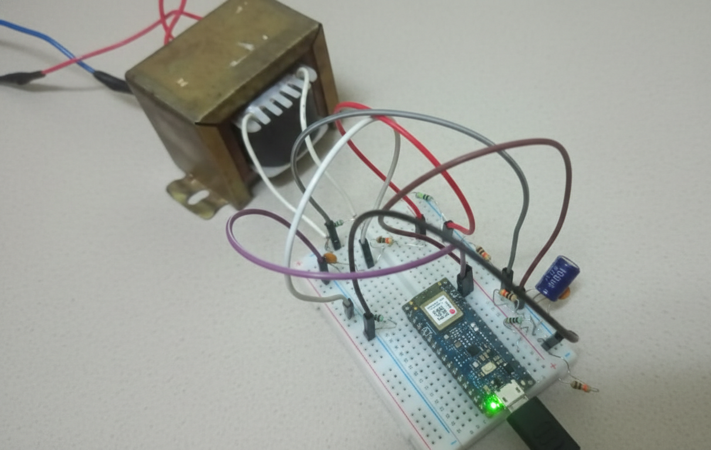
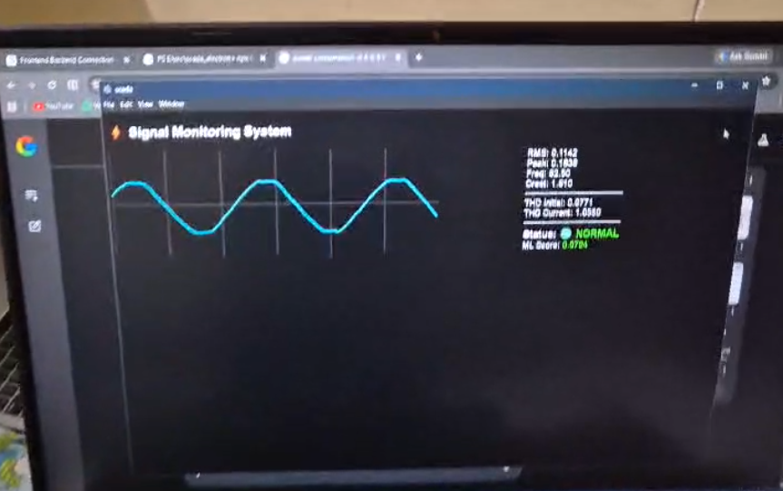
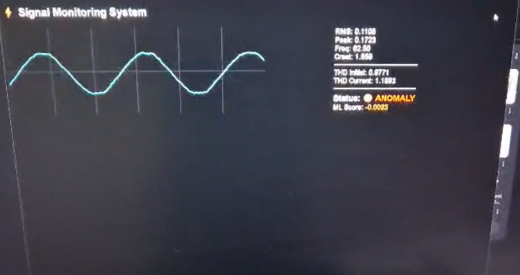

# Real-Time Embedded Power Quality Monitor & SCADA System

> An industrial-grade data acquisition and supervisory monitoring system for real-time waveform visualization, power quality analysis, and ML-based anomaly detection — built with an Arduino Nano 33 BLE and a Python/Electron stack.

---

## What This Project Does

Electrical signals are rarely as clean as we'd like them to be. Harmonics creep in, distortion builds up, and abnormal events go unnoticed until something fails.

This system was built to change that. It monitors electrical signals in real time, computes key power quality metrics (RMS, THD, Crest Factor), runs an unsupervised ML pipeline to catch anomalies before they become problems, and visualizes everything on a live SCADA dashboard — all the way from a microcontroller's ADC pin to an Electron desktop app.

---

## Features

### Hardware & Embedded
- **High-resolution acquisition** — 12-bit ADC sampling at 5 kHz on the Arduino Nano 33 BLE Sense Rev2
- **Precision analog front-end**
  - Mid-supply biasing (~1.65V) to center AC signals within ADC range
  - Voltage divider for safe input scaling
  - RC low-pass anti-aliasing filter for signal integrity
  - Transformer-isolated AC sensing for safe mains monitoring

### Signal Processing & ML (Python Backend)
- **FFT analysis** — frequency domain decomposition of the sampled waveform
- **THD computation** — Total Harmonic Distortion calculated from harmonic content
- **Standard metrics** — RMS, Peak-to-Peak, Frequency, and Crest Factor
- **Anomaly detection** — Isolation Forest model trained on historical baseline data; outputs a confidence score for system stability
- Powered by NumPy, SciPy, and Scikit-Learn

### SCADA / HMI (Supervisory Layer)
- **Electron desktop dashboard** featuring:
  - Live waveform oscilloscope (Canvas-based)
  - Live FFT spectrum visualization
  - Power quality metrics panel
  - Visual alarm indicators — 🟢 NORMAL / 🔴 ANOMALY
- **Streamlit web dashboard** for remote monitoring and CSV data logging

---

## System Circuit

<p align="center">
  
</p>


## System Architecture

```
[ Signal Source ]
       ↓
[ Analog Front-End ]         →  Bias + Scale + Filter
       ↓
[ Arduino Nano 33 BLE ]      →  5 kHz Sampling + Feature Extraction
       ↓
[ Serial Telemetry (UART) ]  →  Frame-based protocol: 'W' (Waveform), 'F' (Features)
       ↓
[ Python Backend ]           →  FFT + THD + Isolation Forest ML
       ↓
[ SCADA HMI (Electron) ]     →  Real-time Visualization & Alarming
```

---

## Tech Stack

| Domain    | Technologies                                              |
|-----------|-----------------------------------------------------------|
| Embedded  | Arduino (C++), PlatformIO, nRF52 architecture             |
| Backend   | Python, NumPy, SciPy (FFT), Scikit-Learn (ML), Pandas     |
| Frontend  | Electron, JavaScript, HTML5 Canvas, Streamlit             |
| Data      | CSV logging, Serial UART @ 115200 baud                    |

---

## Project Structure

```
├── prototype_code/
│   ├── main.cpp              # Arduino firmware — high-speed sampling & frame encoding
│   ├── scada_backend.py      # Python engine — ML, THD, and data coordination
│   └── scada_electron/       # Electron desktop HMI source
├── dataset/
│   └── ...                   # Scripts for baseline "Normal" data collection & model training
└── output/
    └── ...                   # Visualizations — Normal vs. Anomaly comparison outputs
```

---

## Contributors

This project was a collaborative effort combining embedded engineering with advanced data processing:

- **AJ** *(Project Lead)* — Hardware architecture, analog front-end design, and Arduino C++ firmware development
- **Purusharth** — Python backend processing engine (ML pipeline, FFT, THD logic) and SCADA Electron interface development

---

## ⚠️ Safety Notice

This project involves signals derived from mains-level AC voltages. **High voltage is lethal.**

- Always use a step-down isolation transformer (e.g., 220V → 6V or 9V AC output)
- Never connect the Arduino or any microcontroller directly to mains without proper optical or magnetic isolation
- This project is intended for educational and research purposes only

---

---

## Output & Results

<p align="center">
  
</p>

<p align="center">
  
</p>

<p align="center">
  
</p>

---

*Developed as a prototype for advanced Power Quality Monitoring and Predictive Maintenance.*